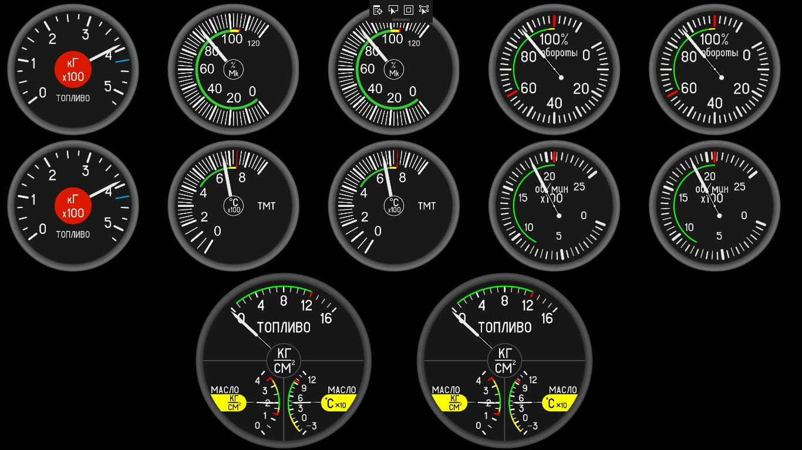
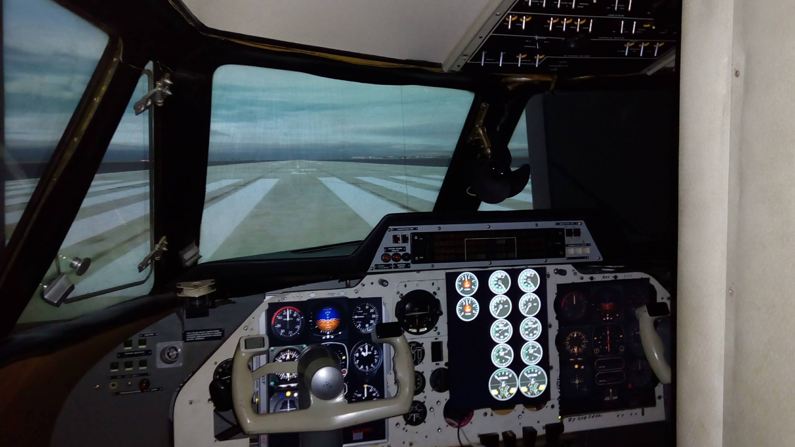

# Indicators' panel
This C# WPF project draws indicatiors of middle (engine) panel of L410 airplane flight simulator. The panel obtains the power plant parameters in json markup through the ethernet network over UDP protocol.

The panel view:

The panels in cockpit of training system:

